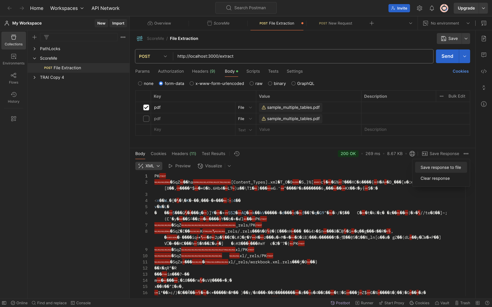

**Report on PDF Table Extraction and Data Processing**

## 1. Introduction
The purpose of this project is to extract structured table data from PDF files and convert it into Excel format while preserving the table alignment and structure. Many real-world applications require automated extraction of tabular data from PDFs, making this implementation useful for data processing, financial analysis, and other structured data management needs.

This project is implemented using **Node.js** and key libraries like `express`, `multer`, `pdf.js`, and `ExcelJS`. It provides an API endpoint where users can upload a PDF file, extract table data, and download it in `.xlsx` format.

---

## 2. Technologies and Libraries Used
The following technologies and libraries were used in this project:

- **Node.js** - Server-side runtime environment for executing JavaScript.
- **Express.js** - A web framework for handling API requests.
- **Multer** - Middleware for handling file uploads.
- **pdf.js** - Extracts text and layout information from PDF files.
- **ExcelJS** - Creates and manipulates Excel files.
- **Postman** - API testing tool used to send PDF files and check responses.

GitHub Repository: [ScoreMe-Assignment](https://github.com/Karan1562/ScoreMe-Assignment)

Additionally, three sample PDFs have been attached to test and verify the implementation.

---

## 3. Implementation Details

### 3.1 Setting Up the Server
The backend is built using **Express.js** to handle file uploads and extraction.

#### **index.js - Setting up the Express Server**
```javascript
import express from "express";
import multer from "multer";
import { getDocument } from "pdfjs-dist/legacy/build/pdf.mjs";
import ExcelJS from "exceljs";
import fs from "fs";
import path from "path";
import { fileURLToPath } from "url";

const __filename = fileURLToPath(import.meta.url);
const __dirname = path.dirname(__filename);

const app = express();
const upload = multer({ dest: "uploads/" });
const OUTPUT_DIR = path.join(__dirname, "outputs");
if (!fs.existsSync(OUTPUT_DIR)) {
  fs.mkdirSync(OUTPUT_DIR, { recursive: true });
}
```

This initializes an Express server, configures Multer for handling PDF uploads, and ensures an output directory exists for saving extracted Excel files.

---

### 3.2 API Endpoint for PDF Upload

```javascript
app.post("/extract", upload.single("pdf"), async (req, res) => {
  try {
    if (!req.file) return res.status(400).send("No file uploaded");
    const pdfPath = req.file.path;
    const textData = await extractTextWithPositions(pdfPath);
    const tables = detectTables(textData);
    
    if (tables.length === 0) {
      return res.status(400).send("No tables detected in the PDF");
    }
    
    const outputPath = path.join(OUTPUT_DIR, `${req.file.filename}.xlsx`);
    await saveToExcel(tables, outputPath);
    res.download(outputPath);
  } catch (error) {
    console.error(error);
    res.status(500).send("Error processing file");
  }
});
```

This API receives a PDF file, extracts tables, saves them as an Excel file, and returns the file as a response.

---

## 4. Testing with Postman

1. **Open Postman**
2. Select **POST** request
3. Enter `http://localhost:3000/extract`
4. Go to **Body → form-data**
5. Set key as `pdf` and choose a sample PDF file
6. Click **Send** and download the extracted Excel file
7. Click **Save Response to File** and save the Excel output.



---

## 5. Included Sample PDFs and Outputs
- Sample PDFs in the **assets/** folder.

---

## 5. Conclusion
This project successfully extracts tabular data from PDFs while preserving alignment and formatting. Using `pdf.js`, we accurately determine table positions, while `ExcelJS` ensures proper structuring in Excel. Further improvements could include **OCR support for scanned PDFs** and **better handling of complex table structures**.

For implementation details, visit the [GitHub Repository](https://github.com/Karan1562/ScoreMe-Assignment).
